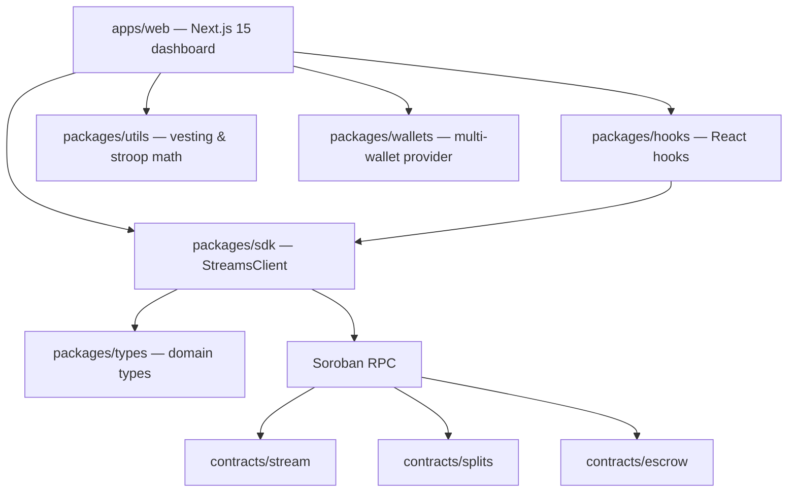

# Architecture

How the Stellar Streams protocol is put together.

---

## Overview

Stellar Streams is a pnpm + Turborepo monorepo containing Soroban smart contracts, a typed
TypeScript SDK, shared utilities, and a Next.js dashboard.

---

## On-chain layer (`contracts/`)

Rust workspaces built with [soroban-sdk](https://crates.io/crates/soroban-sdk) `27.x`.

| Crate    | Responsibility                                                                                          |
| :------- | :------------------------------------------------------------------------------------------------------ |
| `stream` | **Flagship.** Linear vesting streams with cliffs, cancellation, optional protocol fee, and TTL bumping. |
| `splits` | Reusable proportional payment splits with duplicate detection and dust handling.                        |
| `escrow` | Arbiter-based escrow with deadline-driven refunds.                                                      |

Design rules:

1. **Auth first.** Every state-changing entry point calls `require_auth()` on the actor it needs.
2. **Validate before mutating.** Amounts, time ranges, and cliffs are checked up front.
3. **Bump TTLs.** Persistent and instance entries are extended on every write so state never
   unexpectedly expires.
4. **Emit events.** Each lifecycle transition publishes a topic-tagged event for indexers.
5. **No panics for user error.** Recoverable problems return a typed `#[contracterror]`.

Vesting math is intentionally simple and integer-only to avoid rounding surprises; the exact
formula lives in `contracts/stream/src/lib.rs` and is mirrored in TypeScript.

---

## Client layer (`packages/`)

| Package     | Responsibility                                                             |
| :---------- | :------------------------------------------------------------------------- |
| `sdk`       | `StreamsClient` — simulates reads and prepares/signs/submits/polls writes. |
| `types`     | `Stream`, `StreamConfig`, `CreateStreamParams`, status derivation.         |
| `utils`     | BigInt stroop formatting/parsing, duration formatting, vesting math.       |
| `hooks`     | `useStream` — loads a stream + claimable balance with optional polling.    |
| `wallets`   | Unified React context over Freighter, Albedo, Rabet, and Hana.             |
| `ui`        | Shared UI primitives and the Tailwind class helper.                        |
| `contracts` | Generated Soroban TypeScript bindings plus network constants.              |

The SDK never assumes a wallet is present: read methods only need a `publicKey` for simulation,
while write methods require an injected `signTransaction`.

---

## Application layer (`apps/web`)

A Next.js 15 App Router application:

- `/` — product overview.
- `/streams` — create, inspect, withdraw from, and cancel streams.
- `/escrow` — interact with the escrow primitive.
- `/docs` — setup and reference documentation.

---

## Tooling

- **Turborepo** orchestrates `build`, `lint`, `typecheck`, and `test` across the workspace, with
  `typecheck` and `build` depending on upstream builds.
- **Changesets** manages versioning and changelogs.
- **Husky + commitlint + lint-staged** enforce Conventional Commits and formatting on commit.
- **GitHub Actions** runs four jobs: JS lint/format, typecheck, unit tests, and the production
  build, plus a dedicated `contracts` job (`cargo fmt`, `clippy -D warnings`, `cargo test`).
