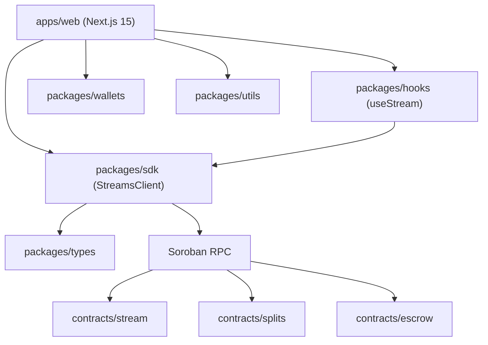

# 🌊 Stellar Streams

<div align="center">

**Continuous payment streams, linear vesting, and payment splits on Stellar & Soroban.**

[](https://github.com/SorobanForge/stellar-starter-kit/actions)
[](LICENSE)
[](contracts)
[](packages)

</div>

---

## What is Stellar Streams?

Stellar Streams is an open protocol for **programmable payments** on Stellar. Instead of sending a
one-off transfer, you can:

- **Stream** tokens continuously to a recipient, who withdraws whatever has vested, at any time.
- **Vest** tokens linearly with an optional cliff — for salaries, grants, and token unlocks.
- **Split** a payment into proportional shares for multiple recipients in a single transaction.
- **Escrow** funds with an arbiter and deadline-based refunds (payment primitive module).

Everything runs on [Soroban](https://soroban.stellar.org) smart contracts written in Rust, with a
typed TypeScript SDK and an open web dashboard.

> **Project status:** pre-1.0. The contracts are implemented, unit-tested, and build clean under
> `clippy` / `rustfmt`. They have **not** been audited or deployed to Mainnet. See the
> [Roadmap](ROADMAP.md) for what's next.

---

## Use cases

| Use case              | How Stellar Streams helps                                        |
| :-------------------- | :--------------------------------------------------------------- |
| **Payroll**           | Stream salary per-second; employees withdraw whenever they like. |
| **Token vesting**     | Linear vesting with a cliff for team/investor allocations.       |
| **Grants & bounties** | Milestone cliffs release funds as work completes.                |
| **Revenue sharing**   | Route a payment to many contributors via a single split.         |
| **OTC / services**    | Optional escrow with an arbiter and deadline refunds.            |

---

## Repository layout

```
stellar/
├── contracts/                # Soroban (Rust) smart contracts
│   ├── stream/               #   ⭐ continuous streaming + linear vesting + protocol fee
│   ├── splits/               #   proportional payment splits
│   └── escrow/               #   arbiter-based escrow primitive
├── packages/
│   ├── sdk/                  # @stellar-starter-kit/sdk     — typed StreamsClient
│   ├── types/                # @stellar-starter-kit/types   — shared domain types
│   ├── utils/                # @stellar-starter-kit/utils   — precise stroop & vesting math
│   ├── hooks/                # @stellar-starter-kit/hooks   — React hooks (useStream)
│   ├── wallets/              # @stellar-starter-kit/wallets — Freighter/Albedo/Rabet/Hana
│   ├── contracts/            # generated Soroban TS bindings
│   └── ui/                   # shared UI primitives
├── apps/
│   └── web/                  # Next.js dashboard (/streams, /escrow, /docs)
├── scripts/                  # cross-platform build/deploy/invoke scripts
└── docs/                     # development guide
```

---

## Architecture



- **Reads** simulate against Soroban RPC. **Writes** are prepared, signed by the connected wallet,
  submitted, and polled to completion — all handled by `StreamsClient`.
- Vesting math is implemented **once in Rust** and **mirrored in TypeScript**
  (`packages/utils`), with tests on both sides.

---

## The `stream` contract

The flagship contract locks tokens up front and releases them linearly.

| Function                                                             | Description                                                               |
| :------------------------------------------------------------------- | :------------------------------------------------------------------------ |
| `initialize(admin, treasury, fee_bps)`                               | Configure the optional protocol fee (cap 10%).                            |
| `create_stream(sender, recipient, token, amount, start, end, cliff)` | Lock tokens and open a stream. Returns the stream id.                     |
| `withdraw(id)`                                                       | Recipient claims the vested, unclaimed balance.                           |
| `cancel(id)`                                                         | Sender cancels; unvested funds are refunded, vested funds stay claimable. |
| `claimable(id)` / `vested(id)`                                       | View helpers.                                                             |
| `get_stream(id)` / `get_config()` / `next_stream_id()`               | Read helpers.                                                             |

Safety properties enforced on-chain: `end > start`, `start ≤ cliff ≤ end`, `amount > 0`,
authenticated sender/recipient, and idempotent cancel. See
[`contracts/stream/src/lib.rs`](contracts/stream/src/lib.rs).

### Vesting math

```
vested(now) = 0                                  if now < start or now < cliff
            = total                              if now ≥ end
            = total * (now - start) / (end-start) otherwise
```

---

## The `splits` contract

The `splits` contract turns one payment into many. A split is an immutable, reusable
configuration of recipients with integer share weights; anyone may pay into it and the funds are
distributed on the spot.

| Function                                    | Description                                                                           |
| :------------------------------------------ | :------------------------------------------------------------------------------------ |
| `create_split(creator, recipients, shares)` | Register a split. Returns the split id; `shares[i]` is the weight of `recipients[i]`. |
| `distribute(split_id, from, token, amount)` | Pull `amount` of `token` from `from` and pay every recipient proportionally.          |
| `get_split(id)` / `next_split_id()`         | Read helpers.                                                                         |

Validation is enforced on-chain: the recipient list cannot be empty, `recipients` and `shares`
must be the same length, every share must be non-zero, and duplicate recipients are rejected.
`distribute` pays each recipient `amount * share / total_shares` with integer math and assigns the
rounding remainder to the final recipient, so no dust is stranded. Each call requires the payer's
signature and emits a `splits`-tagged event for indexers.
See [`contracts/splits/src/lib.rs`](contracts/splits/src/lib.rs).

---

## Quick start

### Prerequisites

- Node.js ≥ 18 and pnpm ≥ 8
- Rust toolchain with the `wasm32v1-none` target (for contracts)
- Docker (optional, for a local Stellar node)

```bash
pnpm install
```

### Run the dashboard

```bash
pnpm run dev        # http://localhost:3000
```

### Build, test, and deploy contracts

```bash
# Unit-test all Soroban contracts (29 tests)
cargo test --manifest-path contracts/Cargo.toml

# Lint and format
cargo clippy --manifest-path contracts/Cargo.toml --all-targets -- -D warnings
cargo fmt --manifest-path contracts/Cargo.toml --all -- --check

# Compile to optimized WASM and deploy to Testnet
pnpm build:contracts
pnpm optimize
pnpm deploy:stream
pnpm deploy:splits
```

### Local node

```bash
pnpm run node:local     # docker compose up -d (Stellar Quickstart)
```

---

## SDK usage

```typescript
import { StreamsClient } from '@stellar-starter-kit/sdk';

const client = new StreamsClient({
  contractId: process.env.NEXT_PUBLIC_STREAM_CONTRACT_ID!,
  rpcUrl: 'https://soroban-testnet.stellar.org',
  networkPassphrase: 'Test SDF Network ; September 2015',
  publicKey: address,
  signTransaction: (xdr) => wallet.signTransaction(xdr),
});

// Open a 100 XLM stream vesting over 30 days.
const { hash } = await client.createStream({
  sender: address,
  recipient,
  token: XLM_TOKEN,
  amount: '1000000000', // stroops
  startTime: now,
  endTime: now + 30 * 86_400,
  cliffTime: now,
});
```

Formatting and vesting helpers live in `@stellar-starter-kit/utils`:

```typescript
import { formatStroopsToXlm, computeVestedAmount } from '@stellar-starter-kit/utils';

formatStroopsToXlm(123_456_789n); // "12.3456789"
computeVestedAmount(schedule, now); // bigint
```

---

## Configuration

Copy `.env.example` to `.env.local` and set:

| Variable                                 | Purpose                                             |
| :--------------------------------------- | :-------------------------------------------------- |
| `NEXT_PUBLIC_STELLAR_NETWORK`            | `local`, `testnet`, or `mainnet`.                   |
| `NEXT_PUBLIC_HORIZON_URL`                | Horizon endpoint.                                   |
| `NEXT_PUBLIC_SOROBAN_RPC_URL`            | Soroban RPC endpoint.                               |
| `NEXT_PUBLIC_STELLAR_NETWORK_PASSPHRASE` | Network passphrase.                                 |
| `NEXT_PUBLIC_STREAM_CONTRACT_ID`         | Deployed `stream` contract id.                      |
| `NEXT_PUBLIC_SPLITS_CONTRACT_ID`         | Deployed `splits` contract id.                      |
| `NEXT_PUBLIC_TOKEN_CONTRACT_ID`          | Token contract to stream (defaults to testnet XLM). |

---

## Maintainers

| Maintainer                                       | Role            | Contact                                   |
| :----------------------------------------------- | :-------------- | :---------------------------------------- |
| [@SorobanForge](https://github.com/SorobanForge) | Lead maintainer | [GitHub](https://github.com/SorobanForge) |

<!-- Replace the Telegram placeholder above with the project's community handle. Telegram is the
     convention for Stellar Wave repos; a reachable contact is part of the approval checklist. -->

## Community

Questions, ideas, and show-and-tell live in [GitHub Discussions](https://github.com/SorobanForge/stellar-streams/discussions).
Security reports go through [SECURITY.md](SECURITY.md), not public issues.

## Deployments

Testnet contract ids and explorer links are recorded in [docs/deployments.md](docs/deployments.md).

## Contributing

We welcome contributions of all sizes. Start with [CONTRIBUTING.md](CONTRIBUTING.md) and the
[Code of Conduct](CODE_OF_CONDUCT.md). Look for issues labelled **`status: good-first-issue`** and
**`status: help-wanted`** (see [`.github/labels.yml`](.github/labels.yml)).

Maintainers can create the planned Wave backlog in one run with
`./scripts/create-issues.sh` and configure branch protection with
`./scripts/setup-branch-protection.sh`.

Good places to start:

- Add an integration test that exercises a full stream lifecycle on a local node.
- Implement the `splits` dashboard page.
- Add multi-token stream support to the SDK.

---

## Roadmap

See [ROADMAP.md](ROADMAP.md). Highlights:

- **Now:** contracts + SDK + dashboard (this release).
- **Next:** Testnet deployments, milestone escrow, event indexer.
- **Later:** multi-token streams, Streams CLI, third-party audit.

---

## Contributors

Thanks to everyone who has contributed to Stellar Streams.

<a href="https://github.com/SorobanForge/stellar-streams/graphs/contributors">
  
</a>

## License

MIT — see [LICENSE](LICENSE).
